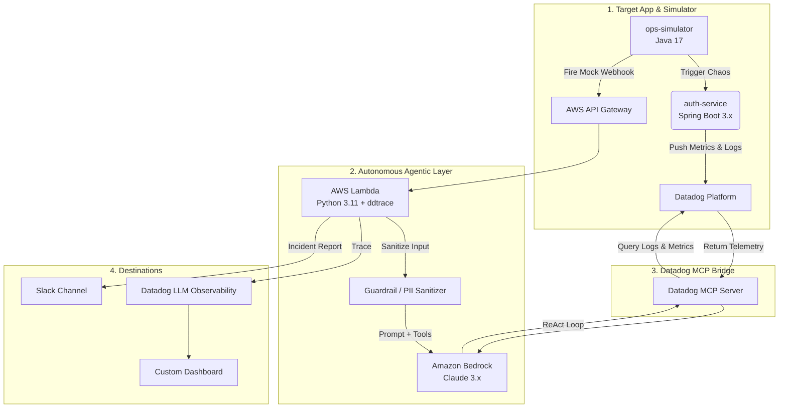

# 🤖 Self-Healing Shadow — Autonomous SRE Copilot

> An AI agent that wakes up when your service breaks, investigates the root cause, and sends a full incident runbook to Slack — all without human intervention.


---

## What is this?

**Self-Healing Shadow** is a hackathon project that turns Amazon Bedrock (Claude) into a fully autonomous Tier-1 SRE responder. When a Datadog alert fires, the system automatically:

1. **Triages** the alert — classifies severity and affected service
2. **Investigates** — queries real logs and metrics via Datadog MCP tools
3. **Remediates** — writes a structured runbook with root cause and fix steps
4. **Notifies** — posts the full incident report to Slack
5. **Traces everything** — every LLM call, token count, and tool invocation lands in Datadog LLM Observability

---

## Architecture



---

## Project Structure

```
.
├── auth-service/               # Target Java Spring Boot app (simulates failures)
├── ops-simulator/              # Traffic chaos generator + webhook sender
│   └── security/               # SecurityAttackSimulator (prompt injection tests)
├── sre-agent-ecs/              # Autonomous SRE Agent — FastAPI + Bedrock + MCP
│   ├── main.py                 # Multi-agent pipeline (Triage → Investigate → Remediate)
│   ├── mcp_client.py           # Datadog MCP subprocess manager (npx stdio transport)
│   ├── requirements.txt
│   └── Dockerfile
├── datadog-dashboard.json      # Import-ready Datadog Screenboard (3 widgets)
├── docker-compose.yml          # Full local dev stack (all services)
└── run-scenario.sh             # One-command end-to-end demo
```

---

## How it works — step by step

### Step 1 — Simulate an outage
`ops-simulator` activates chaos mode on `auth-service`, floods it with traffic, then fires a mock Datadog webhook alert at the Lambda endpoint.

```bash
# Default: chaos drill
java -jar ops-simulator.jar

# Security attack test (prompt injection / PII flood)
java -jar ops-simulator.jar --security-test

# Both
java -jar ops-simulator.jar --all
```

### Step 2 — Lambda receives the alert
The ECS service parses the Datadog-style JSON payload and runs it through a **PII sanitizer** that strips emails, IPs, tokens, and passwords before any data touches the LLM.

### Step 3 — Three-agent pipeline runs

| Agent | Span | What it does |
|---|---|---|
| **TriageAgent** | `sre_agent.triage` | Classifies severity (critical/high/medium/low) and alert type |
| **InvestigatorAgent** | `sre_agent.investigation` | Agentic loop — calls `get_logs` and `get_metrics` via Datadog MCP until root cause is found |
| **RemediationAgent** | `sre_agent.remediation` | Writes the final incident summary + numbered remediation steps |

### Step 4 — Traces land in Datadog
Every Bedrock call is auto-instrumented by `ddtrace`. The root span carries evaluation tags:

```
metadata.alert_severity    = "critical"
metadata.confidence_score  = "0.92"
metadata.model_version     = "claude-3-5-sonnet-..."
metadata.quality_score     = "0.96"
```

### Step 5 — Slack notification
The Lambda posts a Block Kit message to Slack with severity, affected service, root cause, and numbered fix steps.

---

## Quick Start

### Prerequisites
- Java 17+, Maven
- Python 3.11+
- AWS account with Bedrock enabled (Claude 3.5 Sonnet / 3.7 Sonnet)
- Datadog account + API key
- Slack Incoming Webhook URL

### 1. Run locally with Docker
```bash
docker-compose up --build
```

### 2. Configure the ECS Agent
Set these environment variables (or copy `.env.example` to `.env`):

| Variable | Description |
|---|---|
| `BEDROCK_MODEL_ID` | e.g. `us.anthropic.claude-3-5-sonnet-20241022-v2:0` |
| `BEDROCK_REGION` | e.g. `us-east-1` |
| `SLACK_WEBHOOK_URL` | Your Slack Incoming Webhook URL |
| `DD_API_KEY` | Datadog API key |
| `DD_SITE` | e.g. `datadoghq.com` |

### 3. Install dependencies
```bash
cd sre-agent-ecs
pip install -r requirements.txt
```

### 4. Import the Datadog dashboard
```bash
curl -X POST "https://api.datadoghq.com/api/v1/dashboard" \
  -H "DD-API-KEY: $DD_API_KEY" \
  -H "DD-APPLICATION-KEY: $DD_APP_KEY" \
  -H "Content-Type: application/json" \
  -d @datadog-dashboard.json
```

Or via UI: **Datadog → Dashboards → New Dashboard → ⚙️ → Import dashboard JSON**

### 5. Trigger the full demo
```bash
./run-scenario.sh
```

---

## Security Features

The Lambda includes a multi-layer guardrail before any data reaches Bedrock:

- **PII Sanitizer** — regex-based redaction of emails, IPs, AWS keys, bearer tokens, credit cards
- **Prompt Injection Guard** — system prompt instructs the model to ignore any override commands embedded in alert payloads
- **SecurityAttackSimulator** — ops-simulator can fire 6 categories of malicious payloads to validate the sanitizer works

---

## Datadog Dashboard Widgets

| Widget | Type | Shows |
|---|---|---|
| 🔴 System Health | Timeseries | auth-service HTTP 5xx error rate + p99 latency |
| 🤖 Agent LLM Trace | Timeseries | Bedrock latency, token usage, LLM error rate |
| 📋 Live Postmortem | Markdown | Real-time incident summary from the SRE Agent |

---

## Tech Stack

| Layer | Technology |
|---|---|
| Target app | Java 17, Spring Boot 3.x, Micrometer |
| Simulator | Java 17, plain `java.net.http` |
| Agent runtime | ECS (Docker), FastAPI, Python 3.11 |
| LLM | Amazon Bedrock (Claude 3.5 / 3.7 Sonnet) |
| Tool calling | Datadog MCP Server (`npx @datadog/mcp-server-datadog`) |
| Observability | Datadog APM + LLM Observability (`ddtrace`) |
| Notifications | Slack Incoming Webhooks |

---

## Minimum Bar Checklist

- [x] AI Agent calls `get_logs` and `get_metrics` via Datadog MCP
- [x] Bedrock span appears in Datadog LLM Observability
- [x] Custom Datadog dashboard with 3 widgets: System Health, LLM Trace, Live Postmortem
